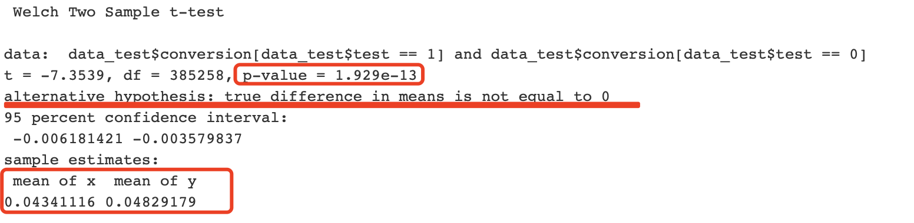

# Data-Challeng-Spanish-Translation-A-B-Test
A/B Test

# Packages requires
`
library(tidyverse)` 
`library(rpart)` 
`library(rpart.plot)` 
`library(psych)`

# Background
Company XYZ is a worldwide e-commerce site with localized versions of the site.

A data scientist at XYZ noticed that Spain-based users have a much higher conversion rate than any other Spanish-speaking country. She therefore went and talked to the international team in charge of Spain And LatAm and receive suggestions from Spain and LatAm country manager that one reason could be translation---all Spanish- speaking countries had the same translation of the site which was written by a Spaniard.

The experiment then started where each country would have its **one translation written by a local**. 
That is, Argentinian users would see a translation written by an Argentinian, Mexican users by a Mexican and so on. Obviously, nothing would change for users from Spain.

# Goal
A/B tests play a huge role in website optimization. Analyzing A/B tests data is a very important data scientist responsibility. Especially, data scientists have to make sure that results are reliable, trustworthy, and conclusions can be drawn.

The major goal is to find out if what impact alteration in the translation could bring onto the conversion rate and to what extent it will have on the rate.

# Procedure
1. Check in with the data(any duplication, missing?)
2. Use Decriptive data to double check the result---Is Spain-based users have a much higher conversion rate than any other Spanish-speaking country?
3. Testing--the resuls is under expectation
4. Use data visulization and designed metrics to second test the result
5. Use decision tree to test randomization

# Result and Conlusion
The testing result shows that 

Not in the test are converting at 4.8% while users in the test just at 4.3%. That’s a dramatic drop if it were true. The most likely reason for weird A/B test results are:

We didn’t collect enough data.(The experimental time is too short)
Some bias has been introduced in the experiment so that test/ control people are not really random

So we check on day to dat variance 

From the plot we could tell that 
1. All of the test_vs_control are smaller than 1, meaning that Test has been constantly worse than control. There’s relatively little variance across the days. That probably means that we do have enough data, but there was some bias in the experiment set up.

2.But there is this rising trend that could possibly exceed 1. And on a side note, the testing just ran for 5 days. Normally, it should always run at least 1 full week to capture weekly pattern, **2 weeks would be predicably better.**

The summary looks very interesting. The split is perfect for the countries on one side of the split(country=Bolivia,Chile,Colombia,Costa Rica,Ecuador,El Salvador,Guatemala,Honduras,Mexico,Nicaragua,Panama,Paraguay,Peru,Venezuela) Indeed, in that leaf the test/control ratio is 0.498, which indicates bias in distribution

So let’s check the test results after controlling for country. That is, we check for each country how the test is doing:

After we control for country, the test clearly appears non-significant. **Not a great success given that the goal was to improve conversion rate, but at least we know that a localized translation didn’t make things worse!**
